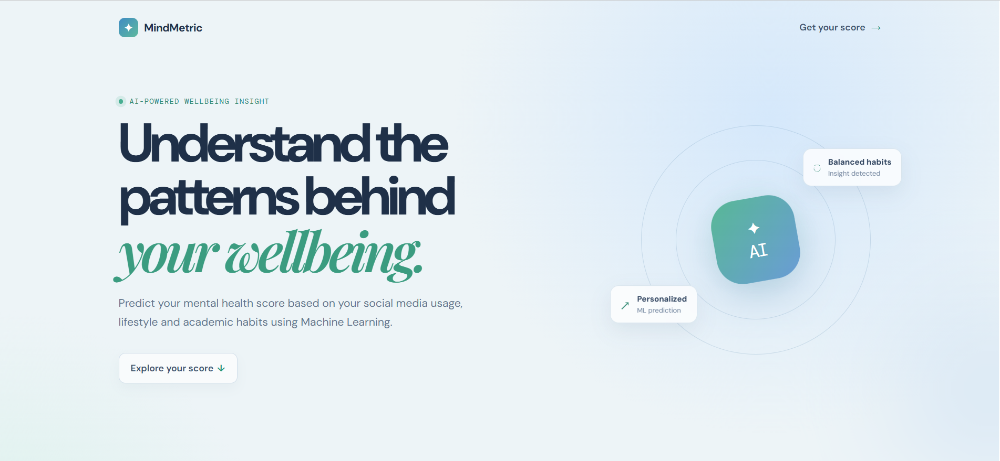
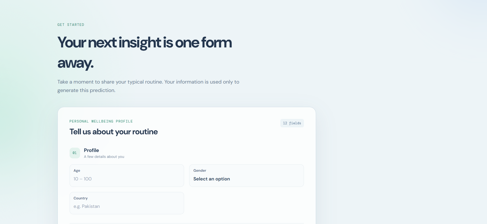
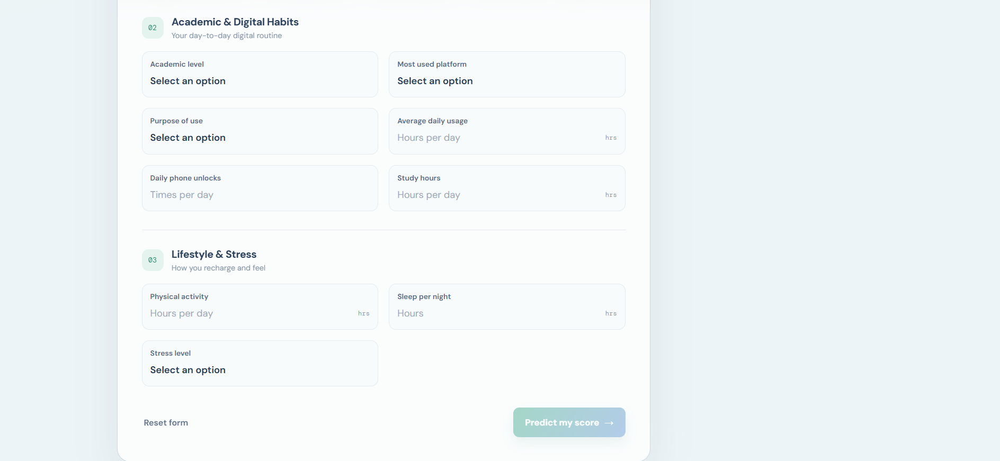
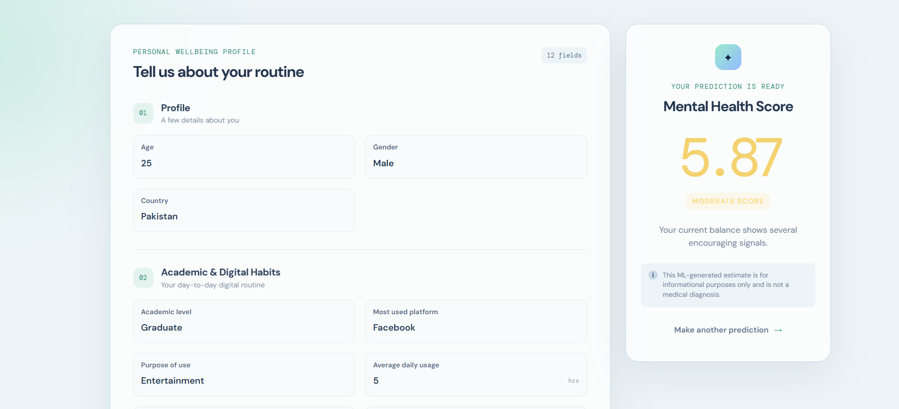

# 🧠 Mental Health Score Predictor

An end-to-end Machine Learning application that predicts a student's **Mental Health Score** based on demographic, academic, social media usage, and lifestyle features.

The project includes a **React frontend**, **FastAPI backend**, **Scikit-learn regression model**, **Docker containerization**, and **AWS EC2 deployment**.

## 🌐 Live Demo

🔗 http://13.60.43.126/

## 📂 GitHub Repository

🔗 https://github.com/rameezulhasan/mental-health-score-predictor

---

## Application Screenshots

### Home Page



### Input Field




### Prediction Result




---

# ✨ Features

- Predicts Mental Health Score in real time
- User-friendly React interface
- FastAPI REST API
- Input validation using Pydantic
- Machine Learning model built with Scikit-learn
- Dockerized frontend and backend
- Deployed on AWS EC2
- CORS enabled for frontend-backend communication

---

# 🛠️ Tech Stack

## Frontend

- React
- Axios
- CSS

## Backend

- FastAPI
- Pydantic
- Pandas
- NumPy
- Scikit-learn
- Joblib

## DevOps

- Docker
- Docker Compose
- AWS EC2
- Docker Hub

---

# 📊 Machine Learning Pipeline

- Data Cleaning
- Feature Engineering
- Country Grouping
- Model Training
- Model Serialization using Joblib
- FastAPI Inference API
- React Integration

---

# 📋 Input Features

| Feature | Type |
|---------|------|
| Age | Integer |
| Gender | Male / Female |
| Country | String |
| Academic Level | Undergraduate / Graduate / High School |
| Most Used Platform | Categorical |
| Purpose of Use | Categorical |
| Average Daily Usage Hours | Float |
| Daily Unlocks | Integer |
| Study Hours | Float |
| Physical Activity Hours | Float |
| Sleep Hours Per Night | Float |
| Stress Level | Low / Medium / High / Very High |

---

# ⚙️ API Endpoint

### Predict Mental Health Score

```
POST /predict
```

Example Request

```json
{
  "age": 20,
  "gender": "Male",
  "country": "India",
  "academic_level": "Undergraduate",
  "most_used_platform": "Facebook",
  "purpose_of_use": "Networking",
  "avg_daily_usage_hours": 5,
  "daily_unlocks": 5,
  "study_hours": 7,
  "physical_activity_hours": 2,
  "sleep_hours_per_night": 6,
  "stress_level": "Medium"
}
```

Example Response

```json
{
    "predicted_mental_health_score": 67.82
}
```

---

# 🚀 Local Installation

Clone the repository

```bash
git clone https://github.com/rameezulhasan/mental-health-score-predictor.git
```

Move into project

```bash
cd mental-health-score-predictor
```

---

## Backend

Install dependencies

```bash
pip install -r requirements.txt
```

Run FastAPI

```bash
uvicorn main:app --reload
```

Backend

```
http://127.0.0.1:8000
```

Swagger Docs

```
http://127.0.0.1:8000/docs
```

---

## Frontend

```bash
cd frontend
npm install
npm run dev
```

---

# 🐳 Docker

## Build Backend

```bash
docker build -t mental-health-backend .
```

## Build Frontend

```bash
docker build -t mental-health-frontend ./frontend
```

Run with Docker Compose

```bash
docker compose up -d
```

---

# ☁️ AWS Deployment

The complete application is deployed on an AWS EC2 instance.

Deployment includes:

- React Frontend
- FastAPI Backend
- Docker Containers
- Docker Compose
- Public EC2 Instance

---

# 📁 Project Structure

```text
mental-health-score-predictor/
│
├── backend/
│   ├── .dockerignore
│   ├── Dockerfile
│   ├── main.py
│   ├── Mental_Health_Model.pkl
│   ├── mental_health_score_predictor.ipynb
│   └── requirements.txt
│
├── frontend/
│   ├── src/
│   ├── .dockerignore
│   ├── Dockerfile
│   ├── index.html
│   ├── package.json
│   └── package-lock.json
│
├── .gitignore
├── docker-compose.yml
└── README.md
```

---

# 📌 Future Improvements

- Authentication
- User History
- Prediction Analytics Dashboard
- Confidence Score
- Explainable AI (SHAP)
- HTTPS with Nginx Reverse Proxy
- CI/CD Pipeline

---

# 👨‍💻 Author

**Rameez Ul Hassan**

AI Engineer

GitHub

https://github.com/rameezulhasan

LinkedIn

https://linkedin.com/in/rameez-ul-hassan

---

## ⭐ Support

If you found this project useful, consider giving it a ⭐ on GitHub.